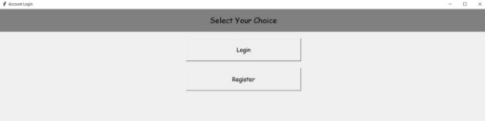
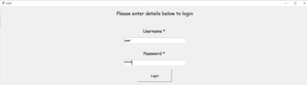
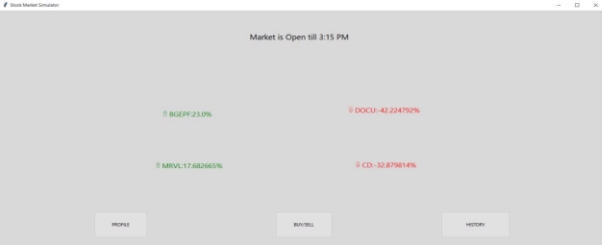
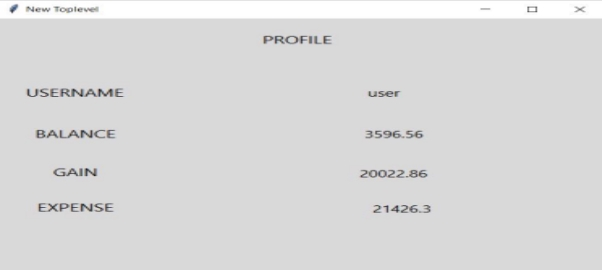
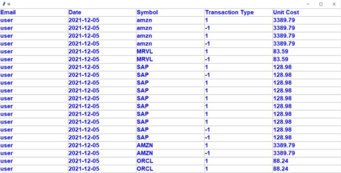
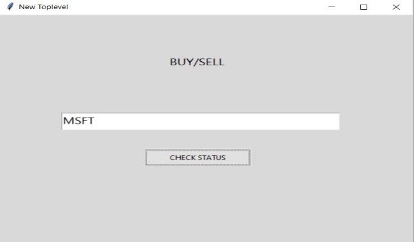
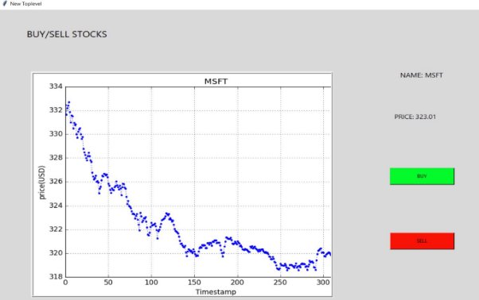
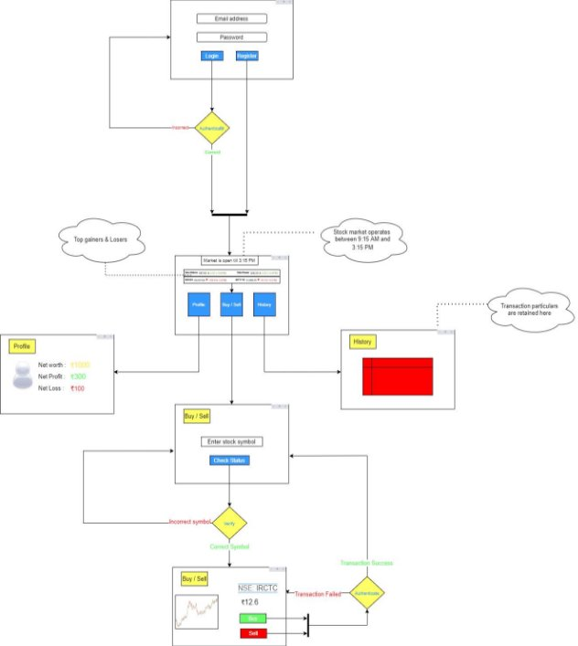

<h1>Advanced Programming Lab (ICT 3166)</h1>

**Stock Market Simulator** 

**A project report by:** 

|Sl# |Full Name |Reg# |Roll# |CCE section name |
| - | - | - | - | - |
|1 |VARSHIL SHAH |190953144 |38 |A (Batch 2) |
|2 |NIHAL RIAN DIAS |190953178 |46 |A (Batch 2) |
|3 |RAORANE SANAT KISHOR |190953222 |53 |A (Batch 2) |

**Introduction**  

If someone solely relies on their salary to fulfil their dream, they might've to work tirelessly forever. Investment in the stock market is one of the best ways to raise capital in the long run, supplemented with a full-time job. 

Stock Market Simulator is a python application that enables users to practice trade with dummy cash. This helps the user get acquainted with the flow of the stock market and even helps them prepare strategies before they risk their real hard-earned money. This tool is an advancement over traditional paper trading. 

**Literature Survey** 

Generally, beginners make huge losses in the stock market due to lack of practice, hesitation while making decisions, and incorrect decision-making. In such cases, tools like the stock market simulator come handy and help a beginner practice to near perfection. -[ cnbc ](https://www.cnbc.com/select/biggest-investing-mistakes/)

Stock market simulators are hence a fun way to learn about trading and investing without risking a penny of your own money. -[ investopedia ](https://www.investopedia.com/articles/active-trading/070814/how-do-you-use-stock-simulators.asp)

**Methodology & Implementation** 

The project spans three main areas. 

- Graphical User Interface 
- Database system 
- Network access and API usage 

The graphical user interface is the most crucial aspect of any application since it determines the ease of access and usability of any application. The Tkinter library was chosen for making the graphical user interface since it comes built-in with Python and provides widgets that suffice the needs of this project.    

The database was implemented using SQLite3. This was used to implement a relational database system that is serverless. This forms the backbone of the application and stores data related to accounts and transactions. 

It is essential that simulation software is as close to reality as possible. To ensure this, the software fetches live/real-time stock quotes and stock charts from the New York Stock Exchange (NYSE). This is done using the API provided by[ Principal APIs ](https://rapidapi.com/principalapis/api/stock-data-yahoo-finance-alternative/)(Yahoo Finance). The connection to the API is achieved through http.client module of Python. The chart data is plotted using the matplotlib library 

In a nutshell, the implementation is as follows: 

1. The user shall first be asked to register, or log-in if already registered 

2. The selection – view shall appear, the user has three choices 
1. Visit **Profile** page 
1. **Buy/Sell** Stock 
1. Check the transaction **History** 

3. The **Profile** page shall display 
1. Balance 
1. Total gain 
1. Total expenditure 

4. The **History** page shall display last 20 buy/sell transactions 

5. **Buy / Sell** stock 

The user shall be allowed to purchase or sell stock subject to fulfilment of the balance requirements. 

**Result** 

The expected flow of the program is as depicted here: 

**Conclusion** 

The app serves as a great enhancement over the traditional paper trading. It has all the essential features which were needed to practise trade including charts which help analysis and a database which keeps track of transactions. 

**Future Work** 

To incorporate a sentiment analysis system to track user emotions and qualities during trading like fear, anxiety, agility etc over a particular period. 
